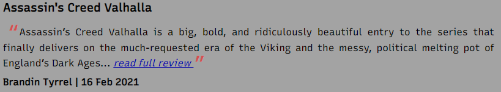
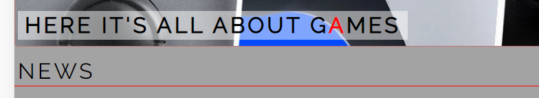
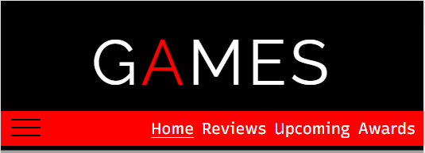
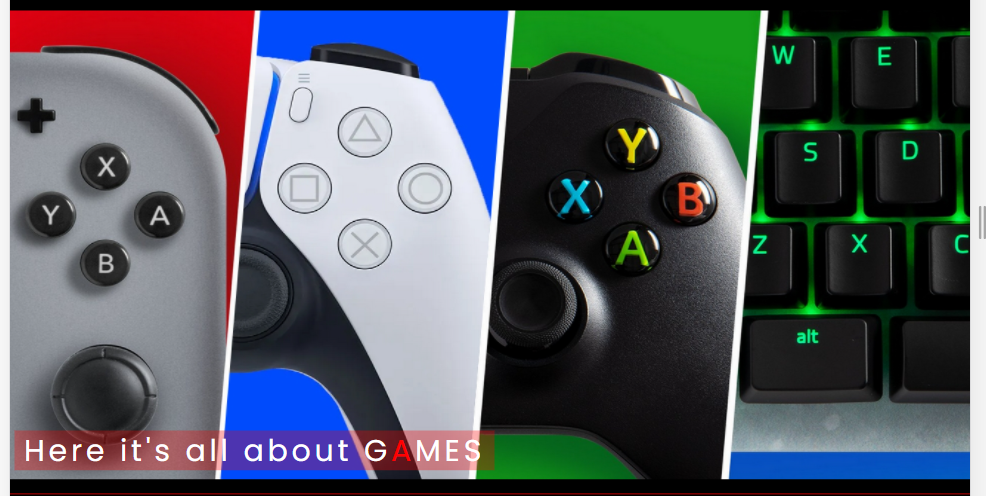
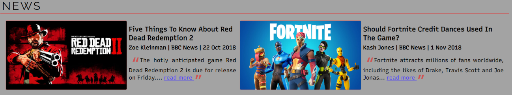
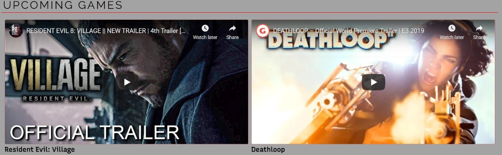
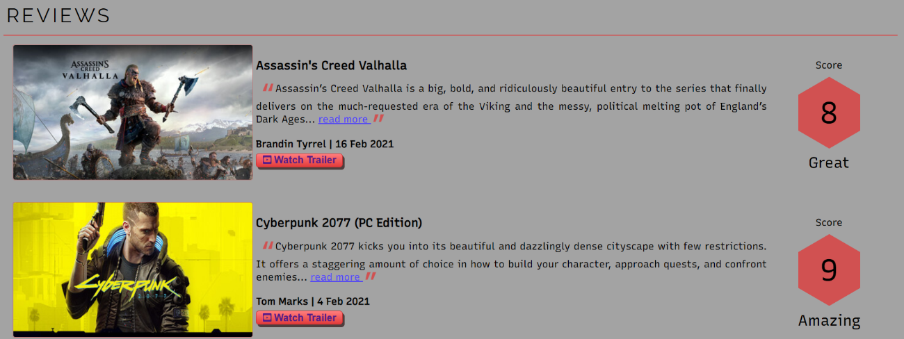
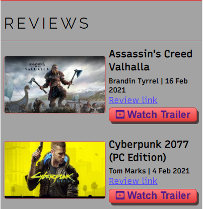
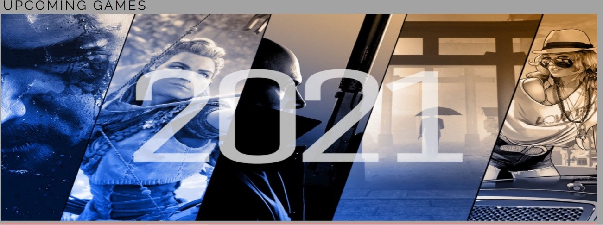
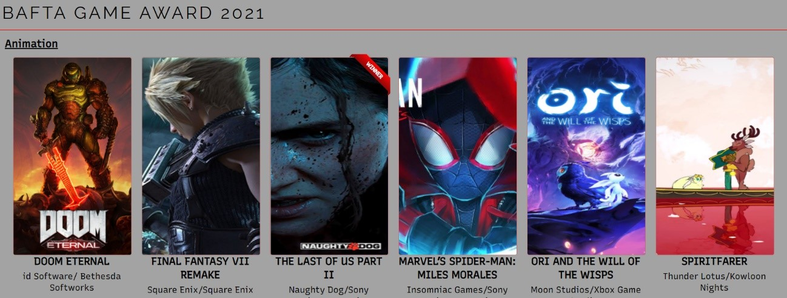

# GAMES

Games is a site that wants to present all types of information about games for all types of platforms. The site targeted those who love games and want to find all types of information such as new games, reviews, and awards in just one place.

https://arthurmezaonik.github.io/portfolio_project_01/index.html

## Author

Arthur Henrique EL Mezaonik Martins

## Design Choices

### Typography

* Raleway - Raleway font was used for the logo and subtitle.

* Recursive - Recursive font was used as the main font.

### Images

The main images on the home page were chosen to represent that the site wants to bring information for all types of platforms.

The game images were chosen to represent what games the topic is about.

The upcoming game page image was chosen to represent the next game releases in the year. 

The images on the awards page represent the games disputing the award.

### Wireframes

[PDF Wireframes](assets/wireframes.pdf)

## Features

### Implemented Features

* Navigation Bar

    

    * Featured on all pages, the navigation bar includes the Logo, Home page, Reviews, Upcoming and Awards page.

    * It’s located identical in each page to allow easy navigation.

    * It adjusts itself from different devices (ex: mobile).

    

* Main Image and Text

    * The main image allows the user to see that the website is for players from all types of platforms, while the paragraph shows us what is the main subject.

* News Section

    

    * The news section allows the user to have an easy way to check the latest news related to games.

    * The news presents a header, author, and a summary about the content with a link for the full news. The link will open the news in a new tab.

* Upcoming Games Video Section

    

    * This section presents to us two trailers from games that will be released in the year, trying to create expectations for the final user.

    * The trailers can be updated as new game trailers are released.

* Footer

    

    * The footer includes links to all relevant social media sites for the Games website. All the links will open in a new tab.

    * The footer includes a form to sign up for a newsletter.

* Review Page

    

    * The review webpage presents for the user some games with a brief summary of the review and a link for the full review. The link will open in a new tab.

    * Each game has a button that will open a new tab with the game trailer.

    * Each game receives a grade.

    

* Upcoming Games Page

    

    * This webpage presents to the user a list of the months of the year that can be expanded to see which games will be released on that specific month.

* Awards Page

    

    * This page will present to the user the last BAFTA game awards list and the winner for each category.

    * For mobile and tablet the games are presented in form of list.

### Future Features

* For future features we hope to implements a way for the user be able to add a comment and a grade for the game reviews.

## Testing

### Validation Testing

* CSS Validator

* HTML Validator

### Lighthouse Test

* Home Page (desktop)

    
    
    * Trust ans Safety: Solved by addind the rel attribute in the anchor tags

* Home Page (mobile)

    

    * Names and labels: not solved

    * Tables and lists: Solved by changing the nest relation from a > li to li > a (nav bar)

* Reviews Page

    

    * Tables and lists: Solved by changing the nest relation from a > li to li > a (nav bar)

* Upcoming Page

    

    * Tables and lists: Solved by changing the nest relation from a > li to li > a (nav bar)

* Awards Page

    

    * Tables and lists: Solved by changing the nest relation from a > li to li > a (nav bar)

### Cross Browser and Cross Device Testing

|  TOOL / Device |  BROWSER |  OS | SCREEN WIDTH  |
|---|---|---|---|
| real phone: iPhone 6  | safari  | iOS  |  375 x 667  |
| real phone: iPhone 8 Plus  | safari  | iOs  |  414 x 736 |
| real tablet: iPad  |  safari |  iOs | 768 x 1024  |
|  dev tools: Moto G4 | chrome  | android  | 360 x 640  |
|  dev tools: iPad Pro |  chrome |  iOs |  1024 x 1366 |
|  dev tools: Galaxy S5 | chrome  |  android | 360 x 640  |
|  real computer: Dell Ispiron | chrome  | Windows 10  | 1920 x 1080  |

### Manual Testing

1. Navigation bar (mobile/tablet):

* Open nav bar

* Go to review page

* Go to upcoming page

* Go to awards page

* Go back to home page

2. Navigation bar (desktop):

* Open nav bar

* Go to review page

* Go to upcoming page

* Go to awards page

* Go back to home page

3. News link

* Click on the link

* Check if link open in a new tab

4. Social media links

* Click on Facebook icon

* Check if it opens in a new tab

* Click on Twitter icon

* Check if it opens on a new tab

* Click on Instagram icon

* Check if it opens on a new tab

* Click on YouTube icon

* Check if it opens on a new tab

5. Newsletter form

* Try to submit the empty form and verify that an error message about the required fields appears

* Try to submit the form with an invalid email address and verify that a relevant error message appears

* Try to submit the form with all inputs valid and verify that a success message appears.

6. Reviews link

* Click on the link

* Check if link open in a new tab

7. Reviews trailer link

* Click on the link

* Check if link open in a new tab

## Deployment

### Deploy to GitHub Pages

* The site was deployed to GitHub pages. The steps to deploy are as follows:
	
* In the GitHub repository, navigate to the Settings tab

* From the source section drop-down menu, select the Master Branch

* Once the master branch has been selected, the page will be automatically refreshed with a detailed ribbon display to indicate the successful deployment.

## Credits

### Content

1. Home Page

* News 1: https://www.bbc.co.uk/news/technology-45940734

* News 2: https://www.bbc.co.uk/news/newsbeat-44492744

2. Reviews Page

* Assassin’s Creed review: https://www.ign.com/articles/assassins-creed-valhalla-review

* Cyberpunk 2077 review: https://www.ign.com/articles/cyberpunk-2077-review

* New Pokémon Snap review: https://www.ign.com/articles/new-pokemon-snap-review

* Hitman review: https://www.ign.com/articles/hitman-3-review

* Among Us review: https://www.ign.com/articles/among-us-review

3. Upcoming Page

* List with upcoming games 2021: https://www.vg247.com/2021/04/29/video-game-release-dates-2021/

4. Awards Page

* BAFTA game awards list: https://www.bafta.org/games/awards/2021-nominations-winners

### Media

1. Home Page

* Main image: https://meuxbox.com.br/noticias/confira-a-lista-de-jogos-cross-play-entre-xbox-playstation-nintendo-switch-e-pc/

* News 1 image: https://www.humblebundle.com/store/agecheck/red-dead-redemption-2

* News 2 image: https://store.steampowered.com/app/812140/Assassins_Creed_Odyssey/

* Deathloop trailer: https://www.youtube.com/watch?v=k4NsBsUbSy8

* Resident Evil trailer: https://www.youtube.com/watch?v=YGQ_YtpTwdc

2. Reviews Page

* Assassin’s Creed image: https://www.xbox.com/en-US/games/assassins-creed-valhalla

* Assassin’s Creed trailer: https://www.youtube.com/watch?v=ssrNcwxALS4

* Cyberpunk 2077 image: https://store.steampowered.com/app/1091500/Cyberpunk_2077/

* Cyberpunk 2077 trailer: https://www.youtube.com/watch?v=UnA7tepsc7s

* New Pokémon Snap image: https://www.nintendo.com/games/detail/new-pokemon-snap-switch/

* New Pokemon Snap trailer: https://www.youtube.com/watch?v=L9Q0JMx08Bs

* Hitman image: https://www.ioi.dk/announcing-hitman-3/

* Hitman trailer: https://www.youtube.com/watch?v=avAXhnbs69w

* Among Us image: https://store.steampowered.com/app/945360/Among_Us/

* Among Us trailer: https://www.youtube.com/watch?v=-LaY8nQyM_0

3. Upcoming Page

* Main img: https://www.gameinformer.com/2021
	
4. Awards Page

* Doom Eternal image: https://slayersclub.bethesda.net/en

* The Last of Us 2 image: https://store.playstation.com/pt-br/product/UP9000-CUSA07820_00-THELASTOFUSPART2

* Final Fantasy VII image: https://www.factmag.com/2019/07/15/final-fantasy-vii-remake/

* Spider Man Miles Morales image: https://www.pinterest.com/pin/1044553707292744498/

* Ori and the Will of the Wisps image: https://www.ign.com/games/ori-and-the-will-of-the-wisps

* Spiritfarer image: https://www.vox.com/culture/2020/9/17/21438643/spiritfarer-video-game-review

* Assassin’s Creed image: https://www.xbox.com/en-US/games/assassins-creed-valhalla

* Cyberpunk 2077 image: https://store.steampowered.com/app/1091500/Cyberpunk_2077/

* Dreams image: https://www.theguardian.com/games/2020/feb/24/dreams-video-games-making-media-molecule-playstation-4

* Ghost of Tushima image: https://www.mycast.io/stories/ghost-of-tsushima/roles/jin-sakai/762550

* Hades image: https://economictimes.indiatimes.com/magazines/panache/independent-video-game-hades-dominates-bafta-games-awards/articleshow/81701411.cms

* Half Life ALYX image: https://salaodejogos.net/aqui-esta-o-novo-half-life/

* Astro’s Playroom image: https://psnprofiles.com/trophies/11753-astros-playroom

* Animal Crossing New Horizons image: https://www.twitch.tv/directory/game/Animal%20Crossing%3A%20New%20Horizons

* Sackboy image: https://www.playstationlifestyle.net/2020/11/23/sackboy-a-big-adventure-review-ps5/

* F1 image: https://news.xbox.com/en-us/2020/07/10/f1-2020-out-now-xbox-one/

* Fall Guys image: https://www.esquire.com/lifestyle/a33509197/fall-guys-game-review/

* The Last Campfire: https://www.nintendo.co.uk/Games/Nintendo-Switch-download-software/The-Last-Campfire-1742914.html

* RÖKI image: https://www.nintendo.com/games/detail/roki-switch/

* Airborne Kingdom image: https://invisioncommunity.co.uk/airborne-kingdom-takes-flight-today-on-the-epic-games-store/

* Call of the Sea image: https://www.instant-gaming.com/en/7940-buy-game-steam-call-of-the-sea/

* Carrion image: https://arstechnica.com/gaming/2020/07/carrion-game-review-a-rare-blend-of-unique-brutal-and-darkly-hilarious/

* Factorio image: https://store.steampowered.com/app/427520/Factorio/

* The Falconeer image: https://www.xbox.com/en-US/games/the-falconeer

* Call of Duty Warzone image: https://support.activision.com/call-of-duty-warzone

* Destiny 2 image: https://virgobrasil.com.br/destiny-2-game-estara-de-graca-ate-dia-18/

* No Man’s Sky image: https://www.gamesradar.com/no-mans-sky-beyond-is-no-mans-sky-2-in-all-but-name/

* Sea of Thieves image: https://www.xbox.com/en-US/games/sea-of-thieves

* Flight Simulator image: https://games.mxdwn.com/news/microsoft-flight-simulator-gameplay-screenshots-from-alpha-test/

* Minecraft Dungeons image: https://www.nintendo.com/games/detail/minecraft-dungeons-switch

* Demon’s Souls image: https://www.ign.com/games/demons-souls

* Before I Forget: https://store.steampowered.com/app/1126600/Before_I_Forget/

* Tell Me Why image: https://www.gamespew.com/2020/08/tell-me-why-review/

* Deep Rock Galactic image: https://news.xbox.com/en-us/2020/05/12/tips-deep-rock-galactic-available-may-13-xbox/

* Valorant image: https://www.riotgames.com/en/news/starting-the-valorant-journey

* Kentucky Route Zero image: https://www.eneba.com/steam-kentucky-route-zero-steam-key-global

* Fortnite image: https://www.microsoft.com/en-es/p/fortnite/bt5p2x999vh2?activetab=pivot:overviewtab

5. Icons
* Facebook, Instagram, Twitter, Youtube and Trophy: https://fontawesome.com/

### Acknowledgments

* Code Institute: Love and Running Project

* CSS Reset: https://meyerweb.com/eric/tools/css/reset/

* Css Hamburger Menu (navigation bar): https://css-tricks.com/three-css-alternatives-to-javascript-navigation/

* Button Generator (reviews page): https://www.bestcssbuttongenerator.com/#/19

* Hexagon shape (review page): https://css-tricks.com/the-shapes-of-css/

* Resize images (review page): https://www.iloveimg.com/pt/redimensionar-imagem

* Collapsible list (upcoming page): https://codepen.io/huange/pen/pJqEMj

* Style for awards page: https://thegameawards.com/nominees

* Ribbon Generator (awards page): https://www.cssportal.com/css-ribbon-generator/

* Malia Havlicek: Reviewing and giving suggestions how to improve my project.
	
